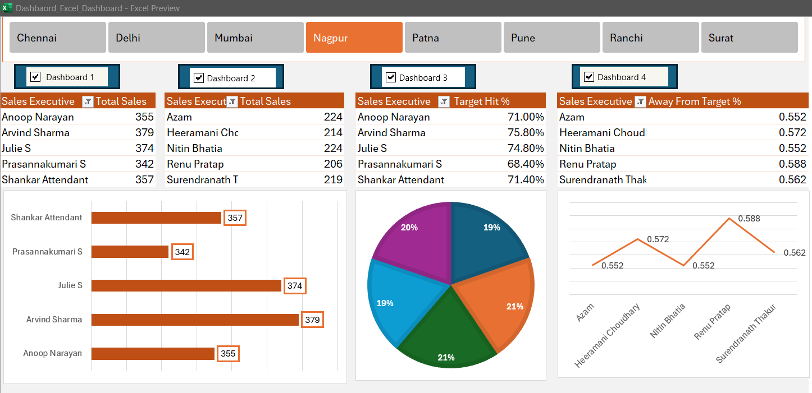

# 📊 Excel Sales Dashboard with VBA Integration  

  

## 🚀 Project Overview  
This project presents a **Sales Dashboard** in Excel, where I cleaned and analyzed the data, created visual insights, and automated certain functionalities using **VBA (Visual Basic for Applications).**  

## 🔹 Features  
✅ **Data Cleaning & Transformation**  
✅ **Interactive Dashboards**  
✅ **Automated Checkboxes with VBA**  
✅ **Sales Insights & KPI Tracking**  
✅ **Graphs & Charts for Better Visualization**  

## 📂 Files Included  
- `Excel_Sales_Dashboard.xlsx` → The main Excel file with cleaned data & dashboard  
- `excel.png` → Preview of the dashboard  
- `README.md` → Project documentation  

## 🛠 Tools Used  
- **Microsoft Excel** (Data Cleaning, Pivot Tables, Charts)  
- **VBA Macros** (For checkbox automation)  

## 📸 Dashboard Preview  
  

## 📥 Installation & Usage  
1. Download or clone the repository  
2. Open `Sales_Dashboard.xlsx` in Excel  
3. Ensure Macros are enabled to use the checkboxes  
4. Explore insights using interactive dashboards  

## 📌 Future Enhancements  
- Adding **Power BI** for advanced visualizations  
- Automating data updates with Power Query  

## 🔗 Connect with Me  
If you have any feedback or suggestions, feel free to connect! 🚀  
